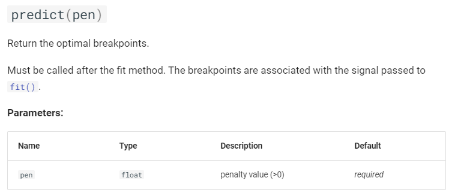

# Raptures
## Metodi di ricerca
### Pelt
Rilevamento del punto di cambio penalizzato.

Per un dato modello e livello di penalità, calcola la segmentazione che riduce al minimo la somma vincolata degli errori di approssimazione.

Parametri:

Predict parametri:

### BinarySeg

Algoritmo di segmentazione binaria (Binseg) fornito dalla libreria ruptures in Python. Questa libreria è comunemente utilizzata per rilevare cambiamenti o discontinuità in serie temporali o sequenze di dati.

Parametri:

Predict parametri:

### Dynp
Trova punti di cambiamento ottimali utilizzando la programmazione dinamica.

Dato un modello di segmento, calcola la partizione migliore per la quale la somma degli errori è minima.

Parametri:

Predict parametri:

## Spiegazione Parametri
### Model
Specifica il modello di rilevamento dei cambiamenti utilizzato.

Esistono diversi tipi di modelli:

+ ***l1*** (Least Absolute Deviation): Questo metodo minimizza la somma degli scarti assoluti tra i punti dati e la linea di regressione. È utile quando si desidera una robustezza maggiore agli outlier rispetto al metodo dei minimi quadrati.
+ ***l2*** (Least Squared deviation): Questo metodo minimizza la somma degli scarti quadrati tra i punti dati e la linea di regressione. È sensibile agli outlier, ma può essere influenzato in modo significativo da essi.
+ ***rbf*** (Kernelized mean change): Questo metodo utilizza una funzione kernel per calcolare la similarità tra i segmenti di dati. È particolarmente utile quando i cambiamenti non sono necessariamente lineari e quando è importante catturare i cambiamenti non solo in valore ma anche in forma.
+ ***normal*** (Gaussian process change): Questo metodo utilizza un processo gaussiano per modellare i dati e individuare i cambiamenti. È utile quando si desidera modellare la correlazione tra i dati e avere una stima della distribuzione dei cambiamenti.
+ ***CostCosine*** (CostCosine): Questo metodo calcola il costo del cambiamento utilizzando la similarità coseno tra i segmenti di dati. Può essere utile quando si desidera rilevare cambiamenti basati sulla direzione dei vettori dei dati.
+ ***linear*** (Linear model change): Questo metodo assume che i dati seguano un modello lineare e cerca i punti in cui il modello cambia. È utile quando si sospetta che i cambiamenti seguano un modello lineare.
+ ***clinear*** (Continuous linear change): Questo metodo assume che i cambiamenti seguano un modello lineare ma possono essere continui nel tempo. È utile quando si desidera rilevare cambiamenti graduati e non repentini.
+ ***rank*** (Rank-based change): Questo metodo si basa sulle classifiche dei dati anziché sui valori effettivi. È utile quando si desidera rilevare cambiamenti nella distribuzione dei dati piuttosto che nei valori stessi.
+ ***mahalanobis*** (Mahalanobis-type change): Questo metodo utilizza la distanza di Mahalanobis per valutare i cambiamenti nei dati. È particolarmente utile quando i dati hanno correlazioni e varianze diverse.
+ ***ar*** (Autoregressive model change): Questo metodo utilizza modelli autoregressivi per rilevare cambiamenti nei dati nel tempo. È utile quando i dati hanno una struttura temporale e si desidera modellare le dipendenze temporali per rilevare i cambiamenti.
+ ***costum*** (Custom): il modello costum consente agli utenti di definire manualmente una funzione di costo personalizzata per identificare i cambiamenti nei dati. Offre una maggiore flessibilità nella definizione dei criteri di cambiamento.

## TODO
- aggiungere un esempio con metodo custom
- capire iperparametri e vedere se ce ne sono altri utilizzabili
